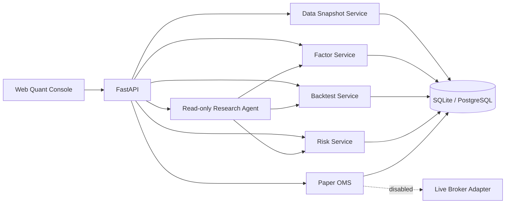
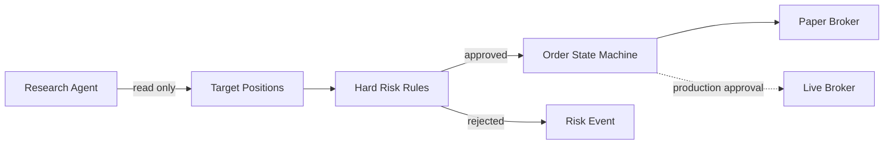

# 架构说明

## 运行结构

首版是模块化单体。领域接口已经分开，后续可按负载把数据计算、回测 Worker、
Agent 和 OMS 独立部署。

## 数据与可复现性

每次因子评估和回测都保存：

- `snapshot_id`
- 因子 ID 与版本
- 完整运行参数
- 结果指标
- 创建时间

真实数据按 SDK 使用活动数据集 ID `tushare-cn-equity-live-v1` 或
`tinyshare-cn-equity-live-v1` 做增量更新，每次同步的参数、状态、写入统计和错误信息
记录在 `data_sync_runs`。日线按交易日同步，指数权重按自然月同步，避免超过接口单次
返回上限并减少重复调用。活动数据集会随同步变化，生产化前需升级为不可变版本和
Manifest，才能保证旧回测严格复现。

真实数据阶段将行情与因子矩阵放入 Parquet/对象存储，元数据和交易账本迁移到
PostgreSQL。研究查询使用 DuckDB/Polars，任务调度使用 Prefect。

## 交易安全

订单写入链路与 Agent 完全分离：

模拟账户当前支持订单幂等、资金校验、可卖持仓校验、单笔规模限制和成交费用。
实盘前还需增加 T+1 可卖数量、交易时段、涨跌停、停牌、部分成交、撤单、成交回报、
断线恢复与券商对账。

## 演进路线

1. 接入真实 A 股 Point-in-Time 数据。
2. 引入 Parquet、DuckDB、PostgreSQL、Redis 和 Prefect。
3. 增加因子代码沙箱、数据泄漏测试和 Walk-forward。
4. 接入原深度研究 Agent 的只读 HTTP API。
5. 连续模拟盘运行并完善 OMS。
6. 审批后接入单一券商的小资金账户。
