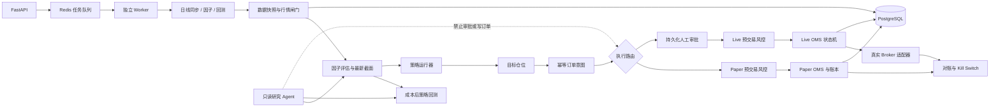
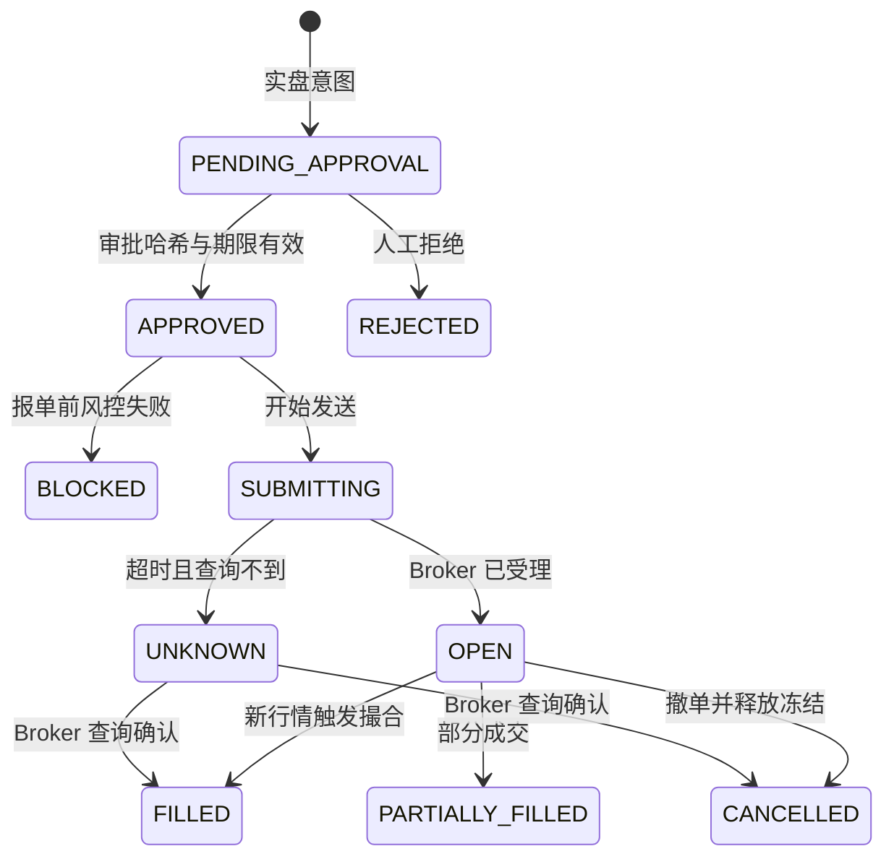

# 架构说明

本文档对应 2026 年 6 月 15 日的代码状态。

## 总体链路

研究 Agent 只读并不表示系统只能研究。确定性的交易链路由策略运行器、风险引擎、
OMS 和 Broker 适配器完成；Agent 负责解释证据，不能绕过硬风控或修改资金。

## 运行组件

| 组件 | 职责 |
| --- | --- |
| FastAPI | HTTP API、认证入口、静态前端 |
| Redis Worker | 异步执行数据同步、因子评估和回测，支持持久状态、重试与恢复 |
| PostgreSQL | 生产环境研究数据、任务、账本、审批、订单与审计真相源 |
| TushareSyncService | 主数据、交易日历、日线、财务和指数成分同步 |
| QuoteService | 实时行情接收、时效判断、日线降级估值 |
| FactorService | 历史面板评估、后台刷新最新截面缓存和缓存读取 |
| BacktestService | T 日信号、T+1 执行、成本和约束回测 |
| StrategyRunnerService | 调仓周期、租约、目标仓位、订单意图和幂等运行 |
| ExecutionRouter | 根据 `paper/live/disabled` 把意图送往正确执行域 |
| PaperExecutionService | 串行账户事务、冻结、撮合、撤单、T+1 和费用 |
| PreTradeRiskService | 实盘行情、价差、限价、资金、可卖量、日亏损和组合风险硬检查 |
| LiveExecutionService | 审批、报单、超时查询、撤单、订单成交同步和状态恢复 |
| LiveTradingGuard | 配置开关、审批、Kill Switch、交易时钟和单笔限额 |
| ReconciliationService | 本地账本与 Broker 现金、持仓和订单差异检查 |
| MockLiveBroker | 持久化模拟超时、未知、拒单、部分成交和撤单失败 |

## 订单状态与恢复

- SQLite 开发模式使用 `BEGIN IMMEDIATE`；PostgreSQL 生产模式使用数据库事务、
  唯一约束和条件更新保护幂等状态迁移。
- 买入挂单冻结现金，卖出挂单冻结可卖数量。
- 买入成交保存下一交易日作为解冻日，周末和节假日不会提前解冻。
- 服务启动及策略轮询会恢复未完成挂单，但旧行情、缺日历或非交易时段不会成交。
- `client_order_id`、每日策略运行唯一键和系统租约共同防止重复下单。
- 实盘审批保存请求哈希和有效期，订单参数变化、审批过期或人工拒绝都会阻止提交。
- 报单超时先按 `client_order_id` 查询；无法确认时保留 `UNKNOWN`，禁止盲目重发。

## 安全闸门

订单进入模拟实盘或真实 Broker 前必须同时满足：

1. 交易日历覆盖当前日期。
2. 当前处于 A 股连续竞价时段。
3. 行情时间不超过 `QUANTDEV_QUOTE_MAX_AGE_SECONDS`。
4. 标的未停牌，限价未越过涨跌停规则。
5. Kill Switch 未激活。
6. 当日亏损未达到 `QUANTDEV_MAX_DAILY_LOSS`。
7. 资金、T+1 可卖量、集中度、换手和单笔规模通过。
8. 写接口通过 `X-Admin-Key`，真实订单按配置完成人工审批。
9. 真实 Broker 健康检查成功且明确返回 `mode=live`。

对账差异在 live/mock_live 模式下可自动激活 Kill Switch。

## 当前边界

- 真实行情推送源需通过 `POST /api/live/quotes` 接入；项目未内置未知来源的盘中接口。
- `MockLiveBroker` 是异常压测器，不是真实券商。
- 真实 Broker 必须实现 `BrokerAdapter`，并通过
  `QUANTDEV_BROKER_ADAPTER=模块路径:工厂函数` 加载；未配置时系统失败关闭，不会使用
  Mock Broker 代替。
- SQLite 仅用于单机开发和测试；生产 Compose 强制使用 PostgreSQL。
- 数据同步、因子评估、因子最新截面分数和回测先写 `task_jobs`，再投递 Redis。Redis 只负责唤醒，
  PostgreSQL 保存任务状态，因此 Worker 或 Redis 重启不会丢失任务。
- `/api/factors/{factor_id}/scores` 只读取 `factor_score_snapshots` 缓存；缓存缺失时必须由
  `/api/factors/{factor_id}/scores/refresh` 后台任务刷新，避免 Web 进程同步做全市场计算。
- `schema_migrations` 记录数据库版本；部署时 `migrate` 一次性容器成功后才启动 API。
- 同步完成会生成密封 Manifest，并将回测和策略运行绑定到 `manifest_id`。Manifest
  记录数据水位和行数，但底层活动 SQLite 仍允许增量修订；严格逐字节复现仍应输出
  不可变 Parquet 分区。
- 权限分三层：`X-Read-Key` 对应只读研究接口，`X-Admin-Key` 对应管理写接口，
  `QUANTDEV_OPERATOR_KEYS` 对应绑定身份的操作员密钥。生产双人复核应使用不同操作员密钥
  完成“审批”和“提交”。
- 真实 Broker 默认可由 `QUANTDEV_BROKER_DRY_RUN=true` 包装为 dry-run：查询透传，报单/撤单
  不发送到真实柜台。就绪度会在 dry-run 开启时阻断真实下单阶段。
- **金额定点数**：现金、费用、成交额、权益等金额由 `quantdev.money` 用 `Decimal`
  量化到“分”后再写库/比较，杜绝浮点漂移；对账按整数“分”精确比较，消除浮点假差异
  （false break）。账本表已新增 `*_cents BIGINT` 影子列并在写入后同步，旧 float/REAL
  字段暂保留用于兼容现有接口；后续可逐步把读取和报表切到 cents/NUMERIC。

## 回测/因子可信度边界（接真实数据前必读）

- **因子前向收益按交易日对齐**：`forward_return` 用全市场统一交易日历定位
  T+forward_days，停牌票在目标日缺数据则跳过，避免不同标的跨不等长窗口导致 IC 不可比。
- **IC / 多空收益用非重叠窗口采样**：相邻采样日至少间隔 `forward_days` 个交易日，
  使每个观测统计独立，`ic_ir` 的 `sqrt(252/forward_days)` 年化与多空收益年化才成立；
  这也意味着 `observations` 约为按日采样的 `1/forward_days`。
- **复权无前视**：因子用每个交易日各自的 `adj_factor` 做后复权（`close×adj_factor`），
  比值天然抵消复权常数，不泄露未来除权除息信息。
- **幸存者 / ST 偏差（受数据模型限制，尚未消除）**：`instruments` 仅存当前证券与当前
  名称，没有时点 ST 标记，也没有退市证券的历史行情。因此 `exclude_st` 用当前 ST 名单
  套用整段历史、价格面板只含当前在册标的，**接真实数据后回测结论会系统性偏乐观**。
  根治需先在数据层补“时点 ST 标记 + 退市证券历史价分区”（见中期数据层规划），属
  纯代码无法解决的限制。
- **回测与纸面引擎成交模型仍不完全一致**：回测用 `close±slippage_bps`，纸面引擎用
  bid/ask±bps；两者无法逐笔对账，回测相对更乐观。

## 上线路线

1. 真实数据回测通过且行情更新到最近完整交易日。
2. 连续模拟盘覆盖至少 20 个交易日。
3. `make verify-broker` 的异常压测在 30 天内通过。
4. 接入券商测试环境，半自动逐单审批并每日对账。
5. 小资金账户运行，单笔和日亏损限额保持保守。
6. 稳定运行后再考虑自动审批，禁止一次性跨阶段。
