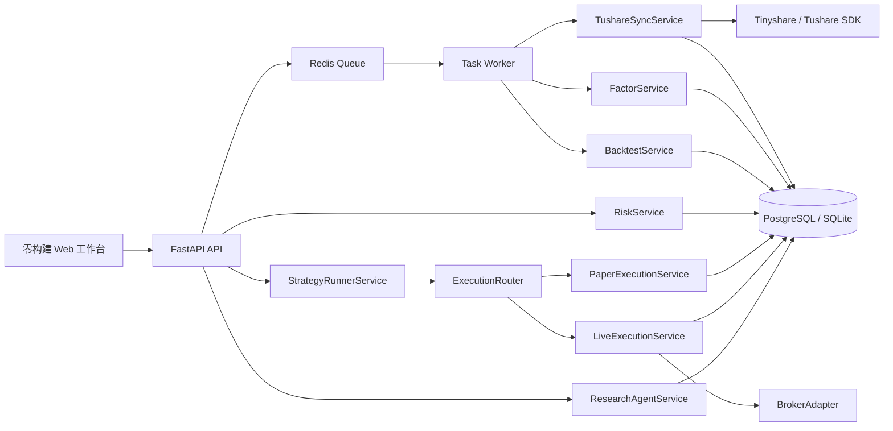
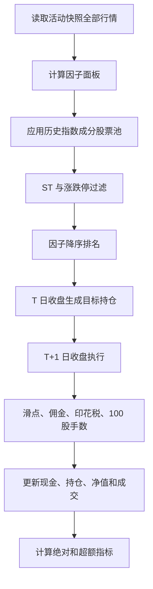

# Quant Dev 项目代码讲解

本文档对应 2026 年 6 月 15 日的代码状态，面向后续开发、排错和功能扩展。

## 1. 项目定位

Quant Dev 当前是一个模块化单体量化系统，已经打通以下链路：

```text
Tinyshare/Tushare 真实数据与盘中行情
  -> 本地研究数据库
  -> 因子计算与评估
  -> 事件式策略回测
  -> 组合风险检查
  -> 策略运行器和幂等订单意图
  -> Paper/Live 执行路由
  -> 持久化审批、预交易硬风控与 OMS
  -> 模拟账本或真实 Broker
  -> 同步、对账和 Kill Switch
  -> 只读研究 Agent
```

当前系统可以用于因子研究、成本后回测、风险规则验证、自动模拟交易和真实 Broker
适配器接入。仓库已经具备实盘状态机，但真实券商连接仍需按最终券商实现；Mock Broker
只用于异常压测，`live` 模式绝不会自动回退到 Mock。

截至 2026 年 6 月 13 日，当前活动行情结束于 2026 年 6 月 10 日。6 月 13 日是周六，
最近完整交易日为 6 月 12 日，因此进入下一次模拟盘前还需同步 6 月 11 日和 6 月 12 日。

| 数据 | 数量 |
| --- | ---: |
| 证券主数据 | 7,078 |
| 日线行情 | 4,431,179 |
| 有行情股票 | 5,662 |
| 行情交易日 | 830 |
| 行情区间 | 2023-01-03 至 2026-06-10 |
| 每日指标 | 4,431,179 |
| 财务指标 | 99,938 |
| 指数历史成分 | 77,701 |
| 因子定义 | 5 |
| 因子评估记录 | 11 |
| 回测记录 | 53 |

这些数字会随真实数据同步继续变化。

## 2. 总体架构



系统仍保持模块化单体代码库，但运行时已经拆分为 API、任务 Worker、策略运行器、
PostgreSQL 和 Redis。数据同步、因子计算和回测不再占用 Web 进程。

## 3. 启动过程

入口位于 `backend/quantdev/api.py`。

FastAPI 生命周期启动时依次执行：

1. `database.migrate()` 创建缺失的数据表和索引。
2. `market_data_service.ensure_factor_definitions()` 注册内置因子。
3. 当 `QUANTDEV_DATA_MODE=demo` 时生成固定随机种子的样例数据。
4. 样例模式下自动补一次因子评估和回测结果。
5. 真实模式不写入任何样例数据。

静态前端通过 FastAPI 的 `/assets` 和根路径直接提供，不需要 Node.js 构建。

## 4. 目录与职责

```text
backend/quantdev/
  api.py                         HTTP 路由、生命周期、静态前端入口
  analytics.py                   收益、回撤、夏普、相关性等统计函数
  cli.py                         数据库、Worker、样例和真实同步命令
  config.py                      环境变量与路径配置
  db.py                          SQLite/PostgreSQL 连接、事务和版本化迁移
  data_migration.py              SQLite 到 PostgreSQL 的 COPY 批量迁移
  models.py                      Pydantic API 请求模型
  store.py                       SQL 查询、持久化与审计封装
  integrations/
    market_data.py               Tinyshare/Tushare SDK 适配器
    broker.py                    Broker 协议、Mock 和真实适配器加载边界
  services/
    market.py                    样例数据、因子定义和真实库重置
    tushare_sync.py              真实市场数据同步
    factors.py                   因子面板、评估和中性化
    backtest.py                  A 股事件式回测
    risk.py                      组合硬风控
    execution.py                 模拟订单、成交和账户账本
    execution_router.py          Paper/Live 执行路由
    pretrade.py                  实盘报单前硬风控
    live_execution.py            审批、实盘订单、撤单和 Broker 同步
    quotes.py                    实时行情接收、时效与日线降级
    strategy.py                  策略配置、最新截面、目标仓位和订单意图
    calendar.py                  交易日与交易时段失败关闭
    reconciliation.py            本地账本与 Broker 对账
    readiness.py                 五阶段实盘就绪度
    agent.py                     只读研究 Agent
    tasks.py                     Redis 投递、任务抢占、重试、恢复和 Worker

frontend/
  index.html                     应用外壳和导航
  assets/app.js                  页面状态、渲染和 API 调用
  assets/styles.css              视觉样式和响应式布局

tests/
  conftest.py                    每个测试创建隔离 SQLite 样例库
  test_api.py                    API 回归测试
  test_services.py               因子、回测、风控、订单和 Agent 测试
  test_strategy_runner.py        策略恢复、租约和意图执行测试
  test_live_execution.py         实盘审批、幂等和失败关闭测试
  test_tushare_sync.py           真实数据同步适配测试
```

## 5. 配置系统

配置集中在 `backend/quantdev/config.py`，项目启动时从根目录 `.env` 读取。

| 环境变量 | 默认值 | 作用 |
| --- | --- | --- |
| `QUANTDEV_ENV` | `development` | 运行环境名称 |
| `QUANTDEV_DATA_MODE` | `demo` | `demo` 或 `real` |
| `QUANTDEV_DATABASE_PATH` | `./data/quantdev.db` | SQLite 文件 |
| `QUANTDEV_DATABASE_BACKEND` | `sqlite` | `sqlite` 或 `postgresql` |
| `QUANTDEV_DATABASE_URL` | 空 | PostgreSQL DSN |
| `QUANTDEV_TASK_BACKEND` | `inline` | 本地 `inline` 或生产 `redis` |
| `QUANTDEV_REDIS_URL` | 本机 Redis | Redis 连接地址 |
| `QUANTDEV_TASK_MAX_ATTEMPTS` | `3` | Worker 最大尝试次数 |
| `QUANTDEV_TASK_VISIBILITY_TIMEOUT_SECONDS` | `1800` | 运行中任务超时恢复阈值 |
| `QUANTDEV_LOG_LEVEL` | `INFO` | 日志级别预留 |
| `MARKET_DATA_SDK` | `tushare` | `tushare` 或 `tinyshare` |
| `TUSHARE_TOKEN` | 空 | 官方 Tushare Token |
| `TINYSHARE_TOKEN` | 空 | Tinyshare 授权码，优先于 Tushare Token |
| `TUSHARE_FINANCIAL_VIP` | `false` | 是否使用全市场 VIP 财务接口 |
| `TUSHARE_CALL_INTERVAL_SECONDS` | `0.35` | SDK 调用最小间隔 |
| `TUSHARE_DEFAULT_INDICES` | 三个中证指数 | 默认同步指数 |
| `DEEP_RESEARCH_BASE_URL` | 空 | 外部研究 Agent 地址预留 |
| `DEEP_RESEARCH_API_KEY` | 空 | 外部研究 Agent 鉴权预留 |
| `QUANTDEV_BROKER_MODE` | `disabled` | `disabled`、`paper` 或 `live` |
| `QUANTDEV_BROKER_ADAPTER` | 空 | 真实适配器工厂，格式 `module:factory` |
| `QUANTDEV_PAPER_ENFORCE_SESSION` | `true` | 模拟实盘是否限制交易时段 |
| `QUANTDEV_PAPER_QUOTE_MODE` | `realtime` | `realtime` 或收盘后验证用 `eod` |
| `QUANTDEV_QUOTE_MAX_AGE_SECONDS` | `15` | 盘中行情最大年龄 |
| `QUANTDEV_QUOTE_MAX_SPREAD_BPS` | `100` | 买一卖一最大允许价差 |
| `QUANTDEV_MAX_DAILY_LOSS` | `1000` | 日亏损熔断金额 |
| `QUANTDEV_APPROVAL_TTL_SECONDS` | `300` | 实盘人工审批有效期 |
| `QUANTDEV_RUNNER_LEASE_SECONDS` | `60` | 策略运行器租约时长 |
| `QUANTDEV_RECONCILIATION_MAX_AGE_MINUTES` | `1440` | 就绪度允许的对账最大年龄 |
| `QUANTDEV_ADMIN_API_KEY` | 空 | 写接口管理员密钥 |

授权码只应保存在本地 `.env` 或部署密钥系统中，不应出现在源码、文档、日志或 Git 历史里。

## 6. 数据库设计

### 6.1 市场数据

| 表 | 作用 | 关键主键或索引 |
| --- | --- | --- |
| `instruments` | 股票代码、名称、交易所、行业和状态 | `symbol` |
| `instrument_metadata` | 上市、退市、市场和原始代码 | `symbol` |
| `trade_calendar` | 交易日历 | `exchange, cal_date` |
| `prices` | OHLC、成交量、成交额、复权因子 | `symbol, trade_date, snapshot_id` |
| `daily_indicators` | 估值、换手、市值和股本 | `symbol, trade_date` |
| `financial_indicators` | 财务指标和原始 JSON | `symbol, ann_date, end_date, update_flag` |
| `indices` | 指数定义 | `index_code` |
| `index_constituents` | 指数历史成分和权重 | `index_code, symbol, trade_date` |
| `data_sync_runs` | 同步参数、状态、统计和错误 | `run_id` |
| `dataset_manifests` | 数据水位、行数、同步任务和密封状态 | `manifest_id` |

行情、每日指标和指数成分已经建立日期与标的复合索引，用于减少大表扫描和临时排序。

### 6.2 研究结果

| 表 | 作用 |
| --- | --- |
| `factor_definitions` | 因子 ID、表达式、版本和状态 |
| `factor_runs` | 因子评估参数和指标 |
| `backtest_runs` | 回测配置、指标、净值曲线和成交 |
| `risk_events` | 触发的风险规则 |
| `audit_logs` | 关键操作审计 |

### 6.3 模拟交易账本

| 表 | 作用 |
| --- | --- |
| `paper_accounts` | 现金、冻结现金、初始资金和账户状态 |
| `paper_positions` | 数量、T+1 冻结、委托冻结和平均成本 |
| `paper_orders` | 幂等委托、状态、成交量、冻结和策略关联 |
| `paper_fills` | 成交价格、数量和费用 |
| `order_events` | 单笔订单事务内事件流 |
| `account_daily_snapshots` | 日初净值、当前净值和日盈亏 |
| `market_quotes` | 最新盘中行情及接收时间 |
| `market_quote_history` | 盘中行情历史和接收留痕 |
| `strategy_configs` | 策略参数与启停状态 |
| `strategy_runs` | 每策略每日唯一运行 |
| `strategy_targets` | 因子分数和目标仓位 |
| `order_intents` | 策略到订单的幂等意图 |
| `order_approvals` | 审批人、理由、请求哈希、有效期和撤销状态 |
| `live_orders` / `live_trades` | 本地实盘 OMS 委托和成交状态 |
| `live_account_state` / `live_positions` | 最近一次 Broker 资金持仓快照 |
| `system_leases` | 防止多个运行器重复执行 |
| `mock_broker_*` | 持久化 Mock 账户、持仓、订单和成交 |

## 7. 真实数据同步

### 7.1 SDK 适配

`TushareAdapter` 对 Tinyshare 和官方 Tushare 暴露统一方法。切换数据源只改变导入的 SDK：

```python
if sdk_name == "tinyshare":
    import tinyshare as ts
else:
    import tushare as ts
```

适配器提供统一限速、最多三次重试、空结果处理和 DataFrame 到字典列表的转换。

### 7.2 同步顺序

一次同步任务按以下顺序运行：

1. 拉取上市、退市和暂停上市证券主数据。
2. 拉取请求区间的上交所交易日历。
3. 按交易日并发拉取日线、复权因子和每日指标。
4. 按市场拉取指数定义。
5. 按自然月拉取所选指数的历史成分权重。
6. 使用普通财务接口按股票拉取，或使用 VIP 接口按报告期拉取。
7. 更新任务状态和写入统计。

日线同步使用 8 个线程提交日期任务，SDK 调用仍由适配器中的锁统一限速。

### 7.3 单位标准化

写入数据库前执行：

- `vol` 从手转换为股，乘以 100。
- `amount` 从千元转换为元，乘以 1,000。
- 股本字段从万股转换为股，乘以 10,000。
- 市值字段从万元转换为元，乘以 10,000。
- 日期统一为 `YYYY-MM-DD`。
- 财务比例字段保留数据源原始单位。

### 7.4 增量与幂等

系统按交易日检查行情和每日指标是否已存在，存在则跳过。指数成分按指数与月份检查，重复运行不会产生重复主键。

当前真实数据仍使用活动快照 ID，例如 `tinyshare-cn-equity-live-v1`。每次成功同步会生成
密封 `dataset_manifest`，保存数据区间、关键表行数、同步任务和创建时间；回测与策略
运行同时保存 `snapshot_id` 和 `manifest_id`，避免只靠一个持续变化的名称定位数据。

这已经提供数据水位级复现，但底层 SQLite 活动表仍可能被数据修订覆盖。要求逐字节复现时应：

1. 每次同步生成不可变批次或数据版本。
2. 研究任务保存数据水位、版本清单或 Parquet Manifest。
3. 新版本通过元数据指针发布，不直接改写旧版本。
4. 回测只读取明确的数据版本。

## 8. 因子引擎

### 8.1 内置因子

| 因子 ID | 含义 | 方向 |
| --- | --- | --- |
| `momentum_20` | 20 日复权收益 | 越高越强 |
| `reversal_5` | 5 日复权收益取负 | 越高越可能反转 |
| `low_volatility_20` | 20 日收益波动率取负 | 越高波动越低 |
| `volume_ratio_20` | 5 日均量相对 20 日均量 | 越高近期放量越明显 |
| `composite_multi` | 低波 60% + 反转 40% | 组合得分越高越优 |

价格类因子使用：

```text
adjusted_close = close * adj_factor
```

这样可以避免除权除息或拆分造成虚假的动量、反转和波动。

### 8.2 合成因子

每个基础因子先在同一交易日截面执行：

1. 中位数和 MAD 去极值。
2. 均值和样本标准差 Z-score 标准化。
3. 按配置权重加总。

合成时只保留所有基础因子都存在的共同标的，避免缺失成分导致实际权重漂移。

### 8.3 行业市值中性化

启用 `neutralize` 后，每个交易日截面依次执行：

1. 按行业减去组内均值。
2. 对 `log(总市值)` 做一元线性回归。
3. 使用回归残差作为最终因子值。

当前行业来自证券主数据的最新行业分类，不是历史时点行业分类，严格的历史研究仍存在分类前视偏差。

### 8.4 因子评估

评估把当日因子值与未来 N 个交易日复权收益对齐，输出：

| 指标 | 计算含义 |
| --- | --- |
| `ic_mean` | 每日 Spearman RankIC 均值 |
| `ic_std` | RankIC 样本标准差 |
| `ic_ir` | IC 均值除以波动并按预测周期年化 |
| `positive_ic_ratio` | IC 大于 0 的交易日比例 |
| `annualized_long_short_return` | 因子顶部三分组减底部三分组的近似年化收益 |
| `observations` | 有效标的日期对数量 |
| `trading_days` | 有效评估截面数量 |

当 `forward_days > 1` 时，相邻日期的未来收益区间会重叠，因此多空年化和 ICIR 是研究近似，不等于无重叠实盘组合收益。

## 9. 回测引擎

### 9.1 回测流程



### 9.2 复权价格

因子使用 `close * adj_factor`。回测交易与估值使用以每只股票最后复权因子归一的前复权式价格：

```text
backtest_price = raw_close * adj_factor / latest_adj_factor
```

这样历史价格保持接近当前价格量级，同时消除公司行为跳变。它仍是研究模拟价格，不等同于券商真实现金分红和送转股账本。

### 9.3 防止前视偏差

- T 日收盘计算因子并生成目标持仓。
- T+1 日收盘执行交易。
- 指数股票池使用回测日期之前最近一次成分快照。
- 多个指数合并时，每个指数独立选择自己的最近快照，再取成分并集。
- 缺少当日行情时按上一有效价格估值，不把停牌持仓归零。

### 9.4 调仓与持仓缓冲

每隔 `rebalance_days` 个交易日调仓。默认选择因子排名前 `top_n`。

启用缓冲带后，已持仓股票只要仍在 `top_n * buffer_multiple` 范围内就优先保留，再用新标的补足。这个机制可以减少排名轻微变化导致的无效换手。

每次调仓先卖出退出标的和高于目标权重的持仓，再买入低于目标权重的标的。

### 9.5 A 股成本与约束

- 买卖数量必须是 100 股整数倍。
- 佣金默认 0.03%，单笔最低 5 元。
- 卖出印花税默认 0.05%。
- 滑点默认 5 bps，买入上浮、卖出下调。
- 可选剔除 ST。
- 可选按板块近似判断 5%、10%、20% 或 30% 涨跌停。
- 涨停不买，跌停不卖。

当前 ST 判断使用证券最新名称，涨跌停使用前收盘价和板块规则近似，不是历史风险警示状态或交易所官方每日涨跌停价。

### 9.6 基准与指标

基准是股票池成分每日收益的等权平均，并随历史成分快照变化。它更接近每日等权再平衡基准，不是严格的一次性买入持有。

主要指标包括：

- 总收益和年化收益。
- 年化波动率、夏普比率、最大回撤、Calmar。
- 成交数、换手率和最终净值。
- 基准收益、基准最大回撤。
- 超额收益、跟踪误差、信息比率和超额最大回撤。

当前 `alpha` 定义为策略年化收益减基准年化收益，不是 CAPM 或多因子回归截距。

## 10. 组合风险

默认硬规则位于 `RiskPolicy`：

| 规则 | 阈值 |
| --- | ---: |
| 单标的仓位 | 25% |
| 总敞口 | 100% |
| 单日计划换手率 | 50% |
| 当前组合回撤 | 15% |
| 单笔委托占净值 | 20% |

同一股票在请求中出现多次时会先聚合权重，不能通过拆分输入绕过单标的上限。

`RiskService.evaluate()` 只计算结果，`RiskService.check()` 还会把违规写入 `risk_events`。模拟买单复用 `evaluate()`，并在拒绝后记录风险事件。

## 11. OMS、审批与账本

模拟账户初始资金为 1,000,000 元。

订单提交流程：

1. 校验买卖方向、委托类型和 100 股手数。
2. 使用 `client_order_id` 检查幂等。
3. 相同 ID 和相同请求直接返回原订单。
4. 相同 ID 和不同请求直接拒绝。
5. 检查交易日历、连续竞价时段和实时行情年龄。
6. 买单计算成交后的组合权重，并执行统一硬风控。
7. 检查现金或可卖持仓。
8. 使用 `BEGIN IMMEDIATE` 串行写订单、资金、持仓、成交和订单事件。

市价单默认只接受 `market_quotes` 中的新鲜盘中行情；`eod` 模式仅用于收盘后验证。

限价单规则：

- 买入限价大于等于最新价时可成交。
- 卖出限价小于等于最新价时可成交。
- 不可成交时状态为 `OPEN`。

`OPEN` 买单冻结现金，卖单冻结可卖数量。`POST /api/paper/match`、服务启动和后台
运行器会重新撮合；撤单释放冻结。买入成交保存下一交易日作为 T+1 解冻日。

账户每日保存日初和当前净值，日亏损达到阈值会立即激活 Kill Switch。订单、目标仓位
和策略运行均有持久化关联，可从 `strategy_run -> order_intent -> paper_order ->
paper_fill` 完整追溯。

实盘链路由 `ExecutionRouter` 和 `LiveExecutionService` 负责：

1. 策略先生成不可重复的 `order_intent`，不直接调用券商。
2. 开启人工审批时，审批记录保存操作人、理由、请求哈希和过期时间。
3. 提交时重新计算请求哈希，并执行行情、价差、时钟、限价、资金、可卖数量、组合风险、
   日亏损、Kill Switch 和 Broker 健康检查。
4. 本地先保存 `SUBMITTING`，再调用 Broker；超时后按 `client_order_id` 查询，未确认则
   保持 `UNKNOWN`，不直接重发。
5. `sync_broker()` 把券商委托、成交、资金和持仓同步到本地实盘状态表。
6. 对账比较本地快照与 Broker 快照，差异可自动激活 Kill Switch。

## 12. 策略运行器

`StrategyRunnerService` 执行以下流程：

1. 获取系统租约，保证同一时刻只有一个运行器。
2. 检查交易时钟和最近完整交易日。
3. 要求活动快照的最大日期等于信号日期。
4. 只读取每只股票最近 21 条行情计算最新因子截面。
5. 按指数时点股票池、因子排名和 `top_n` 生成等金额目标。
6. 保存 `strategy_targets` 和确定性 `order_intents`。
7. 先卖后买，通过执行路由进入 Paper OMS 或 Live OMS。
8. 每策略每日唯一运行；失败、部分完成或活动运行可恢复，已有意图不会重复创建。
9. 运行器持有可续租的系统租约，租约丢失时停止本轮，循环异常使用指数退避。
10. 策略运行和回测都保存对应的 `manifest_id`。

## 13. 研究 Agent

Agent 是系统中的分析层，不是交易执行层。

允许权限：

- `read:factor`
- `read:backtest`
- `read:risk`

禁止权限：

- `write:order`
- `write:cash`
- `write:position`

这种设计并不妨碍系统量化交易。策略、风控和 OMS 才是确定性的交易链路；Agent 负责解释研究结果、寻找风险和组织证据，不应直接修改资金或绕过硬规则。

当前 Agent 仍是本地模板式分析。配置外部研究服务后只切换为 `remote-ready` 标记，远程调用本身尚未实现。

## 14. API 清单

| 方法 | 路径 | 作用 |
| --- | --- | --- |
| GET | `/api/health` | 健康、数据模式和权限状态 |
| GET | `/api/dashboard` | 首页统计和最近回测 |
| POST | `/api/demo/bootstrap` | 生成样例数据 |
| GET | `/api/instruments` | 全部证券主数据 |
| GET | `/api/data/status` | 数据源和同步统计 |
| GET | `/api/data/sync-runs` | 同步任务列表 |
| GET | `/api/data/sync-runs/{run_id}` | 同步任务详情 |
| POST | `/api/data/tushare/sync` | 创建真实数据同步任务 |
| GET | `/api/data/indices` | 指数定义与最新成分统计 |
| GET | `/api/data/financials/{symbol}` | 单只股票财务指标 |
| GET | `/api/market/prices` | 单只股票最近行情 |
| GET | `/api/factors` | 因子定义和最近评估 |
| POST | `/api/factors/{factor_id}/evaluate` | 因子评估 |
| GET | `/api/backtests` | 回测列表 |
| POST | `/api/backtests` | 运行回测 |
| GET | `/api/backtests/{run_id}` | 回测详情 |
| POST | `/api/risk/check` | 组合风险检查 |
| GET | `/api/paper/account` | 模拟账户 |
| POST | `/api/paper/orders` | 模拟委托 |
| POST | `/api/paper/orders/{order_id}/cancel` | 撤销模拟挂单 |
| POST | `/api/paper/match` | 触发挂单撮合 |
| GET/POST | `/api/live/quotes` | 查询或注入盘中行情 |
| GET/POST | `/api/strategies` | 查询或创建策略 |
| POST | `/api/strategies/{id}/enabled` | 启停策略 |
| POST | `/api/strategies/run` | 手动运行策略 |
| GET | `/api/strategies/runs` | 策略运行记录 |
| GET | `/api/strategies/runs/{run_id}` | 目标和订单意图详情 |
| POST | `/api/strategies/intents/{intent_id}/approve` | 持久化批准实盘意图 |
| POST | `/api/strategies/intents/{intent_id}/reject` | 拒绝实盘意图 |
| POST | `/api/strategies/intents/{intent_id}/submit` | 预交易检查后发送 Broker |
| GET | `/api/live/orders` | 本地实盘订单状态 |
| POST | `/api/live/orders/{order_id}/cancel` | 撤销实盘订单 |
| POST | `/api/live/sync` | 同步 Broker 委托、成交和账户 |
| POST | `/api/live/kill-switch` | 激活或解除熔断 |
| POST | `/api/live/reconcile` | 执行 Broker 对账 |
| GET | `/api/live/readiness` | 五阶段就绪度 |
| POST | `/api/agent/research` | 只读研究分析 |
| GET | `/api/system/requirements` | 外部 API 配置状态 |

Swagger 文档位于 `/docs`。

写接口在配置 `QUANTDEV_ADMIN_API_KEY` 后要求请求头 `X-Admin-Key`。

## 15. 测试与质量检查

测试使用临时 SQLite 数据库，每个测试自动迁移并生成固定样例数据，不会修改真实库。

当前覆盖：

- 因子评估可重复性。
- 复权价格对动量因子的修正。
- 回测净值和成交。
- 多指数不同快照日期的股票池合并。
- 风险集中度与重复标的聚合。
- 模拟订单成交和幂等。
- 不可成交限价单保持 `OPEN`。
- 模拟买单复用组合风控。
- 挂单冻结与撤单释放。
- 行情过期拒单、T+1 和日亏损熔断。
- 策略运行计划持久化与每日幂等。
- 策略失败恢复、租约续期和订单状态回写。
- 实盘审批哈希、审批失效、报单超时 UNKNOWN 和禁止盲重试。
- `live` 模式未配置适配器时不回退到 Mock Broker。
- Mock Broker 超时 UNKNOWN、部分成交和终态撤单。
- Agent 不具备写订单权限。
- Tinyshare/Tushare 同步转换。

常用命令：

```bash
make test
make lint
make verify-broker
git diff --check
```

## 16. 当前主要风险与优化路线

### P0: 实盘前必须完成

1. 按最终券商实现真实 `BrokerAdapter`、回报推送和测试环境契约测试。
2. 历史 ST、停复牌、交易状态和官方涨跌停价格。
3. 将 Manifest 进一步落为不可变 Parquet 数据分区和校验和。
4. 将 API Key 和单操作员审批升级为正式身份认证、RBAC、双人审批、CSRF 和限流。
5. SQLite 迁移 PostgreSQL，使用版本化迁移和高可用部署。
6. Walk-forward、样本外检验和生存者偏差检查。

### P1: 数据与计算规模

1. 当前因子和回测会把数百万行数据加载到 Python 内存。
2. 中性化会加载完整市值面板。
3. 应迁移为按日期和股票池裁剪的 Parquet 分区。
4. 使用 DuckDB 或 Polars 做向量化扫描和因子计算。
5. 持久化因子矩阵，避免每次回测重复计算。
6. 把长时间同步和回测放入独立任务队列与 Worker。

### P1: 数据质量

1. 同步目前只要某日期存在记录就认为完成，部分返回可能被误判为完整。
2. 应增加预期行数、校验和、缺失率和异常价格检查。
3. 行业分类应保存历史有效期。
4. VIP 财务同步应按公告日期和报告期联合规划，避免漏掉区间内新公告的旧报告期。
5. 共享 SDK Client 的并发安全需要按具体 SDK 做压力验证。

### P2: 前端与 API

1. 证券和指数接口当前一次返回全部数据，前端会构建数千个选项。
2. 应增加服务端分页、代码搜索和虚拟列表。
3. 回测应异步执行并提供进度、取消和日志。
4. 因子评估应展示完整指标、参数和历史版本。
5. 增加订单事件、成交明细、对账差异和行情源监控页面。

### P2: 工程治理

1. 使用 Alembic 或独立迁移版本替代仅靠 `CREATE IF NOT EXISTS`。
2. 增加结构化日志、指标监控和任务告警。
3. 增加 API 契约测试和大数据性能基准。
4. 拆分前端 `app.js`，按页面和 API Client 分模块。

## 17. 开发流程

### 首次安装

```bash
make install
make install-tinyshare
```

### 启动

```bash
make dev
```

访问 `http://127.0.0.1:8000`。

### 命令行同步

```bash
.venv/bin/python -m quantdev.cli sync-market \
  --start-date 2025-01-02 \
  --end-date 2026-06-10
```

### 启动策略运行器

```bash
make paper-runner
```

Docker 中使用：

```bash
docker compose --profile paper-live up -d
```

### 扩展新因子

1. 在 `market.py` 注册因子定义、表达式和版本。
2. 在 `FactorService._factor_value()` 实现单股票时序计算。
3. 明确因子方向、最小窗口和复权方式。
4. 添加公司行为、缺失值和边界日期测试。
5. 运行标准评估和成本后回测。

### 扩展新数据字段

1. 在 `db.py` 增加字段或新表。
2. 为真实数据库编写可版本化迁移。
3. 在适配器声明接口字段。
4. 在同步服务中转换单位和空值。
5. 在 Store 中增加结构化查询。
6. 添加假适配器测试，避免单元测试访问外网。
